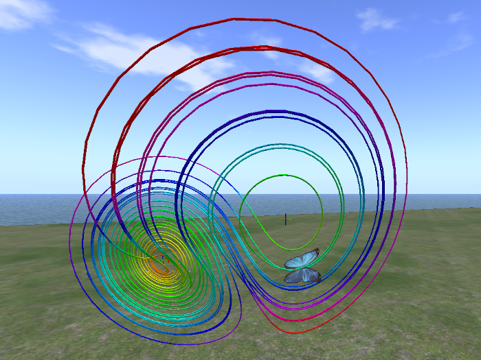
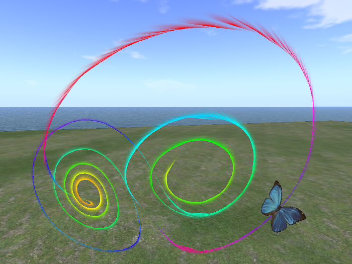
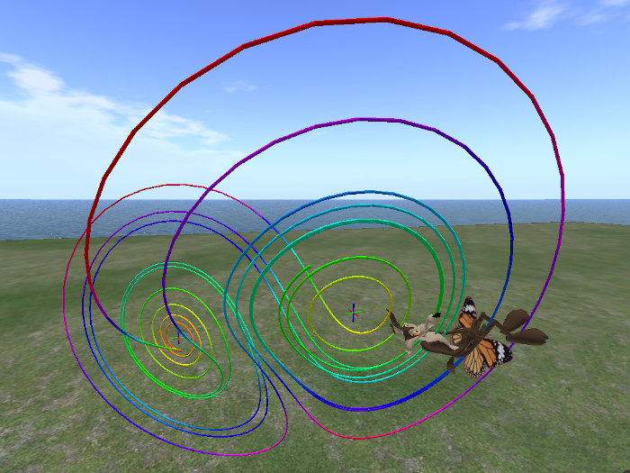
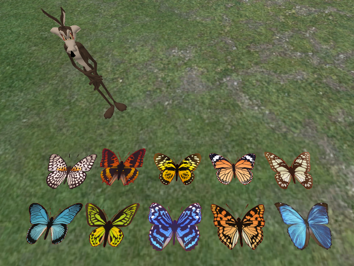

# Fourmilab Chaos Butterfly

[Fourmilab Chaos Butterfly](https://marketplace.secondlife.com/p/Fourmilab-Chaos-Butterfly/24053377)
Fourmilab Chaos Butterfly for the Second Life virtual world demonstrates the phenomenon of chaos in classical mechanics by implementing a Lorenz system, the mathematical model originally developed by Edward Lorenz in 1963 based on convection in the Earth's atmosphere. As Lorenz studied the behaviour of his model, simulated on a rudimentary computer system, he discovered that even the slightest change in the starting point would result in an entirely different evolution of the system with time. This was the first discovery of the mathematical phenomenon of chaos and what has come to be called the "butterfly effect": where the beating of the wings of a single butterfly in a jungle halfway around the world may result in the formation of a hurricane on the other.

Fourmilab Chaos Butterfly lets you create one or more butterflies which fly through the air in Second Life along the trajectories of the Lorenz model, demonstrating its chaotic behaviour. You can sit on a butterfly and experience the wild ride for yourself, with chat commands allowing you to set any of the parameters of the model and observe how they alter its behaviour. You can also wear the butterfly as an avatar accessory, which lets you fly with it in areas where you do not have permission to create objects.

The model is fully scriptable with commands supplied in notecards in its inventory and scripts may define pop-up menus through which an avatar may interact with the model. A collection of butterfly textures are included so you can distinguish multiple butterflies from one another or just choose one you find pleasing. A Deployer is included, which makes it easy to hatch as many butterflies as you wish, each of which will wheel and gyre through the sky of your simulation.

This repository contains all of the software and resources, including
programs in Linden Scripting Language, notecards, and development
documentation, tools, and resources used in the model and its
development.  The actual model is built within Second Life and these
components are installed within it.

The
[complete package](https://marketplace.secondlife.com/p/Fourmilab-Chaos-Butterfly/24053377)
is available for free in the Second Life Marketplace.  This repository
contains everything in the model (except the prims, which are objects
built within Second Life), plus additional resources for developers who
may wish to extend or adapt the model as they wish.  The model is
delivered with "full permissions": those who obtain it are free to
copy, modify, and transfer it to other users within Second Life.

A [video demonstration](https://www.youtube.com/watch?v=TBA)
is available on YouTube.

All of this software is licensed under the Creative Commons
Attribution-ShareAlike license.  Please see
[LICENSE.md](LICENSE.md) in this repository for details.

Please see the
[Fourmilab Chaos Butterfly User Guide](notecards/user_guide.nc)
for details.
